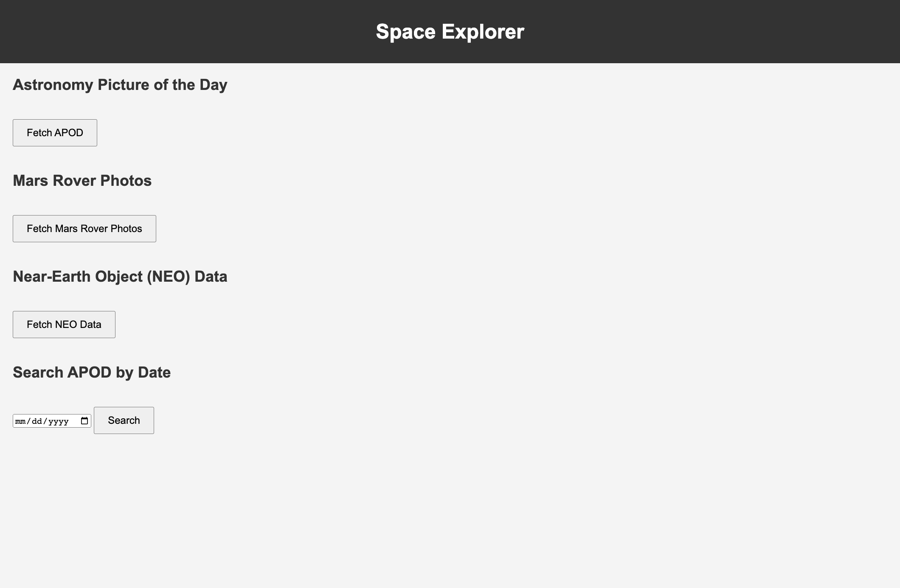
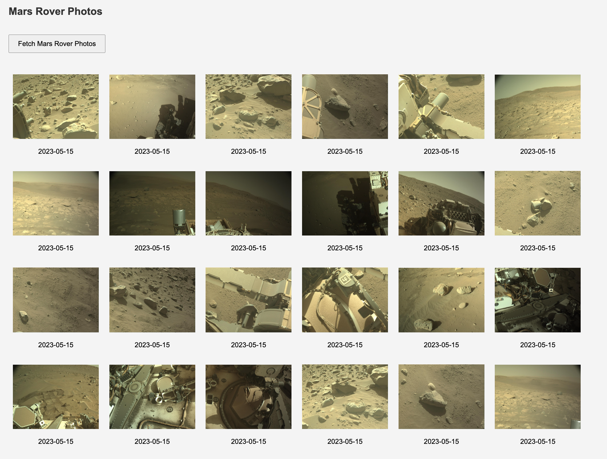
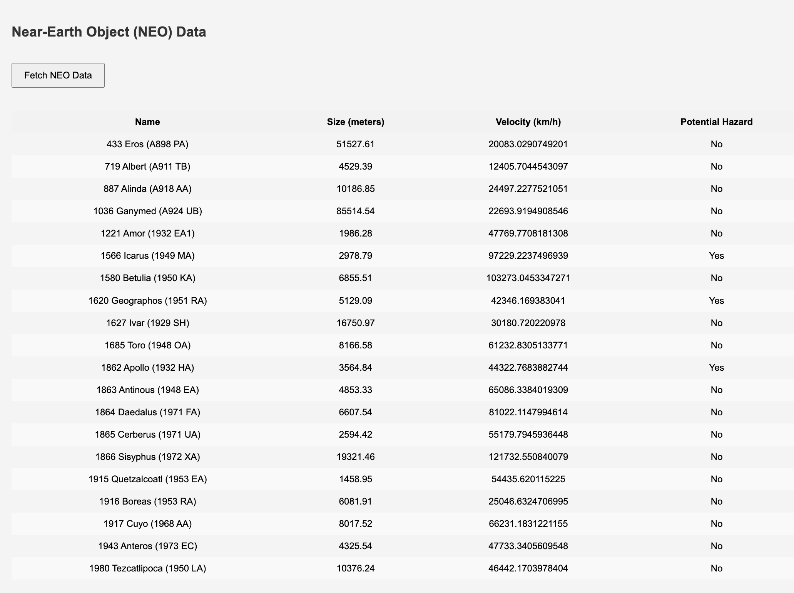
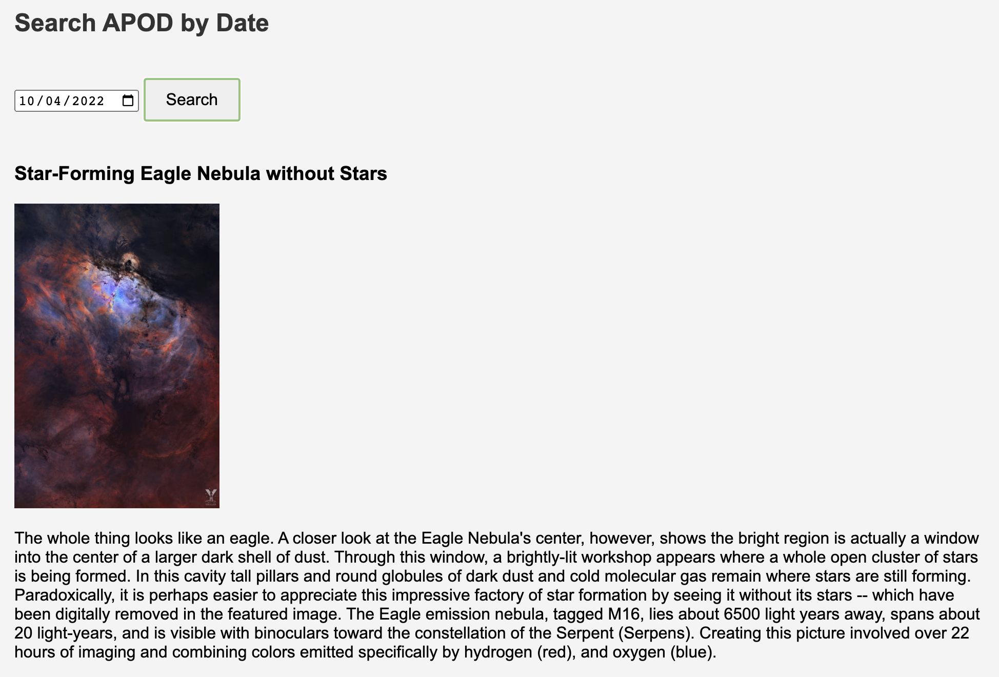

# Space Explorer

This project is your opportunity to work with a real-world API, specifically the NASA API.

## Context
3rd party APIs are a crucial part of web development. They allow you to integrate functionality and data from other providers, increasing the capabilities of your application without the need to develop everything from scratch. 

In this assignment, you will design and implement a web-based application called "Space Explorer". This application will interact with the NASA API to provide users with fascinating information about space. A major aspect of this project involves understanding and securing API keys. *Please be aware that this app is rendering client-side, which puts your API key at risk if you publish your repo publicly.*

## User Story
**AS A USER** I want to view the Astronomy Picture of the Day (APOD), **SO THAT** I can learn more about the universe.

**AS A USER** I want to see 14 random photos from the Mars Rover: Perseverance, **SO THAT** I can explore the Red Planet's surface.

**AS A USER** I'm interested in Near-Earth Object (NEO) data, **SO THAT** I can understand the potential asteroid hazards.

**AS A USER** I want to have a search functionality, **SO THAT**  I can find specific APOD from a previous date.

**AS A USER** I want a visually pleasing application, **SO THAT** my exploration of space data is enjoyable.

## Task List
### Task 1: Fetch APOD
- Fetch the APOD data from the NASA API.
- Display the APOD image on the application.
- Show the title and explanation of the APOD below the image.

### Task 2: Fetch Mars Rovers Photos
- Fetch the Mars Rover Perseverance photos from the NASA API.
- Display the fetched images in a gallery or grid format.
- Show the date below each image.

### Task 3: Fetch Near-Earth Object (NEO) data
- Fetch the NEO data from the NASA API.
- Display the NEO data in a table or list format including name, size, velocity, and potential hazard status.

### Task 4: Implement search functionality
- Implement a search bar.
- Enable the search bar to query APOD from a specific date.
- Display the APOD image with title and explanation of photo.

### Task 5: Responsive Web Design
- Design the application following best practices for user interface and user experience.
- Ensure the application design is responsive for various screen sizes.
- Refer to the provided gif and/or screenshots for functionality, but feel free to create your own style.

### Task 6: Documentation
- Create a ReadMe file that explains how your app functions

## App Demo

## Extra Credit
For additional credit, set up a simple backend and incorporate a .env file for server-side rendering. This will not only enhance the performance of your app but will also provide an additional layer of security for your API key. A sample .env file will be provided for you to use as a reference.

## Grading Rubric
- API Implementation and functionality (40%)
- User Interface and User Experience (30%)
- Error Handling (10%)
- Code Quality (Clean Code) (10%)
- ReadMe (10%)

## Resources
[NASA API Documentation](https://api.nasa.gov/)

[How to use Fetch API](https://developer.mozilla.org/en-US/docs/Web/API/Fetch_API)

[How to handle errors in Fetch API](https://rapidapi.com/guides/error-handling-fetch)

[Introduction to Responsive Web Design](https://www.w3schools.com/css/css_rwd_intro.asp)

Please note: Always ensure to follow the usage guidelines provided by the API to avoid breaching any terms of service. 
Happy Coding!

## App Screenshots
  
  
  
  

